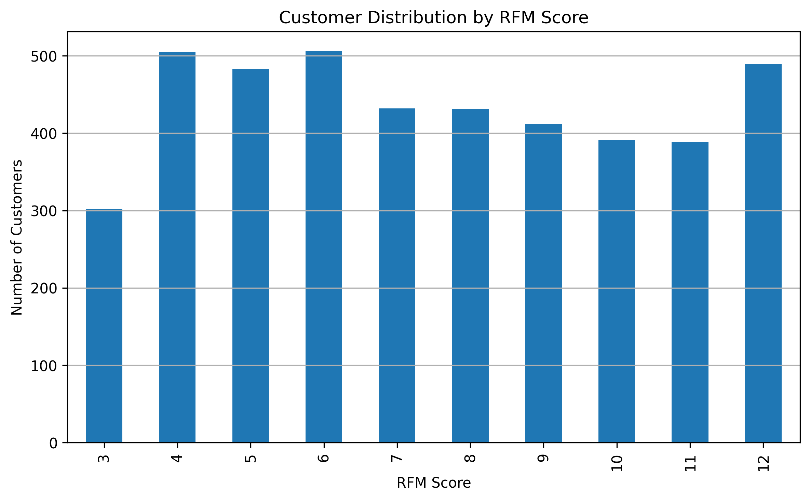

# Customer Segmentation using RFM Analysis

This project applies **RFM analysis (Recency, Frequency, Monetary)** to segment customers based on their purchase behavior using the [Online Retail Dataset](https://archive.ics.uci.edu/ml/datasets/online+retail). The analysis is performed in Python and visualized using Matplotlib and Seaborn.

## Objectives

- Calculate **Recency, Frequency, and Monetary** values for each customer
- Assign **RFM scores** and segment customers accordingly
- Visualize RFM distribution and monetary heatmap
- Gain insights into customer behavior for targeted marketing strategies

## Dataset

- **Source:** UCI Machine Learning Repository
- **Format:** CSV
- **Records:** ~500,000 transactions
- **Time period:** December 2010 – December 2011
- **Key columns:** `InvoiceNo`, `StockCode`, `Description`, `Quantity`, `InvoiceDate`, `UnitPrice`, `CustomerID`, `Country`

## Methodology

1. **Preprocessing:**
   - Remove duplicates and canceled transactions
   - Convert `InvoiceDate` to datetime
   - Remove null `CustomerID`

2. **RFM Calculation:**
   - **Recency:** Days since last purchase
   - **Frequency:** Number of purchases
   - **Monetary:** Total spend

3. **Scoring and Segmentation:**
   - R, F, M scored from 1 to 4 using quartiles
   - Combined into a single RFM score (e.g., 444, 321, etc.)
   - Analyzed by score distribution

## Visualizations

### 📊 Customer Distribution by RFM Score

This chart shows how many customers fall into each RFM score group. The most frequent scores range from 4 to 6, which helps identify large customer segments.

### 🔥 Heatmap of Average Monetary Value by Recency and Frequency

The heatmap displays the **average monetary value** for each combination of recency and frequency scores. Higher scores indicate more valuable customers. Customers with **high recency and frequency** (bottom-right) are the most profitable.

## Insights

- Customers with **higher frequency and recent activity** spend significantly more.
- Segmenting by RFM helps **target promotions**, **loyalty rewards**, and **re-engagement campaigns**.
- Focus on converting low-frequency or inactive high spenders into frequent buyers.

## Tools & Libraries

- Python
- Pandas
- NumPy
- Matplotlib
- Seaborn
- Jupyter Notebook